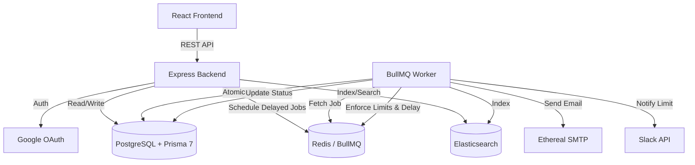

# ReachInbox Email Scheduler

A production-ready full-stack email scheduling application built for the ReachInbox hiring assignment.

## Features
- **Email Scheduling**: Schedule large batches of emails via CSV upload or manual entry.
- **Idempotency**: Prevents duplicate sends on worker crashes using atomic database state transitions.
- **Rate Limiting**: Distributed Redis-based hourly limits per sender with safe auto-rescheduling.
- **Minimum Delay**: Configurable delays between individual sends, coordinated across multiple workers using Redis Lua scripts.
- **Slack Notifications**: Real Slack OAuth integration to notify users when limits are reached (deduplicated via Redis).
- **Google OAuth**: Real Google OAuth 2.0 authorization code flow with secure HTTP-only session cookies.
- **Queue Management**: BullMQ for delayed jobs (no cron), visible via a Bull Board dashboard at `/admin/queues`.
- **Search**: Elasticsearch integration for quick email lookups, with seamless PostgreSQL fallback.

## Architecture Diagram


## Technology Stack
- **Backend**: Node.js (20+ LTS), Express.js, TypeScript, Prisma 7 (@prisma/adapter-pg), BullMQ, @elastic/elasticsearch, Zod, Nodemailer
- **Frontend**: React 19, Vite, Tailwind CSS, React Router, Axios, PapaParse, Lucide React
- **Infrastructure**: Docker Compose (PostgreSQL 15, Redis 7, Elasticsearch 8.11)

## Environment Setup
1. Copy `.env.example` to `.env` in the root and `backend/.env`.
2. Configure credentials in `.env`:
   - `DATABASE_URL`: PostgreSQL connection string.
   - `REDIS_URL`: Redis connection string.
   - `ELASTICSEARCH_URL`: Elasticsearch connection string.
   - `GOOGLE_CLIENT_ID` / `GOOGLE_CLIENT_SECRET`: Real Google OAuth credentials (required for Google Login).
   - `SLACK_CLIENT_ID` / `SLACK_CLIENT_SECRET`: Real Slack OAuth credentials (required for Slack connection).
   - `SMTP_HOST` / `SMTP_PORT` / `SMTP_USER` / `SMTP_PASS`: Ethereal or standard SMTP credentials.

## Step-by-Step Execution Guide

### 1. Start Infrastructure (Docker)
```bash
docker compose up -d
```
Starts PostgreSQL on port `5432`, Redis on port `6379`, and Elasticsearch on port `9200`.

### 2. Setup Database (Backend)
```bash
cd backend
npm install
npx prisma generate
npx prisma db push
```

### 3. Run Backend API Server
```bash
cd backend
npm run dev
```
Starts Express API on port `5000` (Health check at `http://localhost:5000/api/health`).

### 4. Run BullMQ Background Worker
```bash
cd backend
npm run worker
```
Starts the email processing worker with configurable concurrency (`WORKER_CONCURRENCY`).

### 5. Run Automated Tests
```bash
cd backend
npm run test
```
Runs the full Jest test suite covering worker idempotency, minimum delay, rate-limiting, rescheduling, SMTP errors, and Slack deduplication.

### 6. Run Frontend Application
```bash
cd frontend
npm install
npm run dev
```
Starts Vite dev server on `http://localhost:5173`.

---

## Production Scripts Reference

### Backend (`/backend`)
- `npm run dev`: Starts the backend in development watch mode using `tsx`.
- `npm run worker`: Starts the BullMQ email worker using `tsx`.
- `npm run test`: Executes the Jest test suite.
- `npm run build`: Compiles TypeScript to `dist/`.
- `npm run typecheck`: Runs `tsc --noEmit` type checking.
- `npm start`: Runs the compiled production server.
- `npm run start:worker`: Runs the compiled production worker.

### Frontend (`/frontend`)
- `npm run dev`: Starts the Vite development server.
- `npm run build`: Compiles TypeScript and builds the production bundle with Tailwind CSS.

---

## Core Strategies & Behavioral Specifications

### 1. No-Cron Architecture
The system strictly avoids `cron`, `node-cron`, `setInterval`, or OS crontabs. All scheduled and delayed emails are dispatched using BullMQ's native delayed job scheduler backed by Redis sorted sets.

### 2. 1000+ Email Handling & Concurrency
When a user schedules 1000+ emails:
1. The backend stores the emails in PostgreSQL and creates individual delayed jobs in BullMQ.
2. The HTTP response returns immediately without blocking.
3. Concurrent workers process emails in parallel (controlled by `WORKER_CONCURRENCY`).

### 3. Atomic Idempotency Strategy
To prevent double sends on worker crash or duplicate job delivery:
1. The worker performs an atomic SQL update: `UPDATE "Email" SET status = 'processing', attempts = attempts + 1 WHERE id = $id AND status = 'scheduled'`.
2. Only the worker that successfully claims the row (`count === 1`) proceeds to send.
3. If an email is already marked `sent`, it is immediately skipped.
4. *Documented Limitation*: Standard SMTP protocols do not support distributed two-phase commits. If a network partition occurs between SMTP acknowledgement and the database update, a duplicate could occur upon retry.

### 4. Distributed Hourly Rate Limiting
Rate limiting is tracked using atomic Redis counters with sender and hour-window keys (`rate-limit:{userId}:{hourWindow}`):
- When the limit (`MAX_EMAILS_PER_HOUR`) is reached, the email is **not** dropped or failed.
- The job is safely rescheduled to the start of the next hour using `job.moveToDelayed(nextHour)`.

### 5. Minimum Delay Coordination
To enforce `MIN_DELAY_BETWEEN_EMAILS` across distributed workers:
- An atomic Redis Lua script checks and updates `last-send:{userId}`.
- If the required delay has not elapsed, the job is delayed by the remaining duration.

### 6. Restart & Crash Persistence
- **Jobs**: BullMQ persists all queue states in Redis. If the backend or worker crashes, jobs resume automatically upon restart.
- **Data**: PostgreSQL persists all user, campaign, and email records.

### 7. Elasticsearch with PostgreSQL Fallback
- Sent emails are indexed in Elasticsearch asynchronously.
- If Elasticsearch is offline or unreachable, the worker logs the issue without crashing, and search queries transparently fall back to PostgreSQL `LIKE/ILIKE` queries.

---

## Verification & Testing Status

| Component | Status | Verification Detail |
|-----------|--------|---------------------|
| Docker Infrastructure | **VERIFIED** | PostgreSQL, Redis, Elasticsearch running healthy via Docker Compose. |
| Prisma 7 Configuration | **VERIFIED** | Migrated to `prisma.config.ts` with `@prisma/adapter-pg` driver; `generate` and `db push` pass. |
| Backend TypeScript Check | **VERIFIED** | `npm run typecheck` (`tsc --noEmit`) passes with 0 errors. |
| Backend Production Build | **VERIFIED** | `npm run build` generates clean `dist/` bundle. |
| Frontend Production Build | **VERIFIED** | `npm run build` compiles Vite + Tailwind CSS bundle cleanly. |
| Jest Test Suite | **VERIFIED** | 9/9 tests pass across worker and Slack test suites. |
| API Runtime & Health | **VERIFIED** | Express server starts on port `5000` and responds with `{ "status": "ok" }` on `/api/health`. |
| BullMQ Worker Runtime | **VERIFIED** | `npm run worker` starts cleanly and connects to Redis. |
| Google OAuth Flow | **REQUIRES EXTERNAL CREDENTIALS** | Implementation complete with authorization-code exchange and session cookies. Requires valid `GOOGLE_CLIENT_ID` / `GOOGLE_CLIENT_SECRET`. |
| Slack OAuth & Notifications | **REQUIRES EXTERNAL CREDENTIALS** | Implementation complete with Redis deduplication and Slack API client. Requires valid `SLACK_CLIENT_ID` / `SLACK_CLIENT_SECRET`. |
| Ethereal SMTP Sending | **REQUIRES EXTERNAL CREDENTIALS** | Implementation complete with Nodemailer. Requires test credentials from ethereal.email. |
