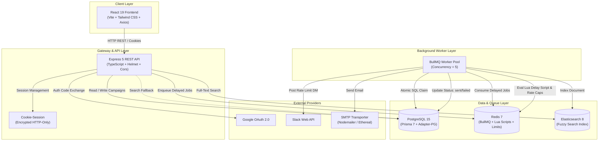

# ReachInbox — Technical Interview & Deep-Dive Study Guide

This technical guide is built directly from the **actual code implementation** of the ReachInbox Email Campaign Automation Platform. It provides end-to-end architectural walkthroughs, data flow diagrams, and a comprehensive question bank designed for technical interviews, system design discussions, and HR rounds.

---

## Table of Contents
1. [Project Overview](#1-project-overview)
2. [Complete System Architecture](#2-complete-system-architecture)
3. [Frontend Request Flow](#3-frontend-request-flow)
4. [Backend Request Flow & Middleware](#4-backend-request-flow--middleware)
5. [Authentication Flow (Google OAuth 2.0)](#5-authentication-flow-google-oauth-20)
6. [Email Scheduling & Ingestion Flow](#6-email-scheduling--ingestion-flow)
7. [Database Schema & Prisma ORM Flow](#7-database-schema--prisma-orm-flow)
8. [Redis Architecture & Caching Flow](#8-redis-architecture--caching-flow)
9. [BullMQ Queue & Delayed Job Flow](#9-bullmq-queue--delayed-job-flow)
10. [Worker Execution & Processing Pipeline](#10-worker-execution--processing-pipeline)
11. [Rate Limiting & Anti-Burst Delay Flow](#11-rate-limiting--anti-burst-delay-flow)
12. [Concurrency Control & Idempotency](#12-concurrency-control--idempotency)
13. [Elasticsearch Full-Text Search & SQL Fallback](#13-elasticsearch-full-text-search--sql-fallback)
14. [Slack OAuth & Alert Notification Flow](#14-slack-oauth--alert-notification-flow)
15. [SMTP Delivery & 3-Tier Fallback Flow](#15-smtp-delivery--3-tier-fallback-flow)
16. [Docker Architecture](#16-docker-architecture)
17. [Production Deployment Architecture](#17-production-deployment-architecture)
18. [Deep-Dive Technical Interview Question Bank](#18-deep-dive-technical-interview-question-bank)

---

## 1. Project Overview

**ReachInbox** is a distributed, full-stack email campaign orchestration platform designed for high-volume cold email scheduling, sliding-window rate limiting, concurrency management, and real-time alerting.

### Core Problem Solved
When scheduling outbound email campaigns at scale (1,000+ recipients):
1. **Sender Reputation & ESP Blocks**: Blasting emails all at once triggers spam filters. ReachInbox enforces inter-send gaps (e.g., 2s) and hourly sending caps (e.g., 100/hr) per sender.
2. **Crash Resilience & Idempotency**: If a worker or server crashes mid-flight, emails must neither be lost nor sent twice.
3. **High-Speed Search**: Querying millions of historical sent emails by subject or body cannot bottleneck relational databases.
4. **Real-Time Operator Visibility**: Operators need immediate alerts on rate-limit triggers (via Slack) and live queue inspection (via Bull Board).

---

## 2. Complete System Architecture



---

## 3. Frontend Request Flow

1. **User Interaction**:
   - The user opens the React dashboard (`/dashboard`), enters campaign details (subject, body, start time, delay, hourly limit), and optionally uploads a recipient CSV.
2. **Client-Side Processing**:
   - `PapaParse` parses CSV files client-side, trims whitespace, and strips duplicates.
   - `AuthContext` ensures the user has an active session before making API requests.
3. **API Dispatch**:
   - `apiClient` (`axios` instance with `withCredentials: true`) dispatches `POST /api/emails/schedule` to the backend.
4. **Reactive UI Updates**:
   - React displays loading state during submission.
   - On success, the UI navigates to `/dashboard` and loads scheduled emails via `GET /api/emails/scheduled`.

---

## 4. Backend Request Flow & Middleware

1. **Reverse Proxy Trust**:
   - `app.set('trust proxy', 1)` enables correct protocol detection behind Render / Cloudflare SSL termination.
2. **Security Headers & CORS**:
   - `helmet()` attaches standard security headers.
   - `cors()` validates origins, supports credentials, and dynamically allows the configured frontend URL and `onrender.com` subdomains.
3. **Session Middleware**:
   - `cookie-session` decrypts the `session` cookie using `SESSION_SECRET` with `sameSite: 'none'` and `secure: true` in production.
4. **Routing**:
   - `/api/auth` $\rightarrow$ Google OAuth endpoints.
   - `/api/emails` $\rightarrow$ Campaign scheduling, scheduled list, sent history, and search.
   - `/api/slack` $\rightarrow$ Slack OAuth connection and disconnection.
   - `/admin/queues` $\rightarrow$ Bull Board dashboard for queue monitoring.
5. **Centralized Error Handling**:
   - `errorHandler` catches unhandled exceptions and formats consistent JSON error responses (`{ error: message }`).

---

## 5. Authentication Flow (Google OAuth 2.0)

1. **Initiation**:
   - User clicks "Sign In with Google" $\rightarrow$ redirects to `GET /api/auth/google`.
   - Backend generates Google consent URL with scopes `userinfo.profile` and `userinfo.email` (`getGoogleAuthUrl()`).
2. **Consent & Callback**:
   - User grants permission on Google Accounts.
   - Google redirects to `GET /api/auth/google/callback?code=AUTH_CODE`.
3. **Token Exchange**:
   - Backend posts the code to `https://oauth2.googleapis.com/token` with `client_id`, `client_secret`, and `grant_type: authorization_code`.
   - Backend retrieves user ID, email, name, and profile picture from `https://www.googleapis.com/oauth2/v1/userinfo`.
4. **User Persistence**:
   - `findOrCreateUser()` upserts the `User` record in PostgreSQL by `googleId`.
5. **Session Creation**:
   - Backend sets `req.session = { userId: user.id }` and redirects to `${config.frontendUrl}/dashboard`.
6. **Session Check**:
   - On frontend load, `GET /api/auth/me` verifies session validity and returns user details and Slack connection status.

---

## 6. Email Scheduling & Ingestion Flow

1. **Input Validation**:
   - Request payload is validated with Zod (`scheduleSchema`):
     ```typescript
     subject: string (min 1)
     body: string (min 1)
     recipients: array of valid emails (min 1)
     startTime?: ISO date string
     delayBetweenEmails?: number (default 2s)
     hourlyLimit?: number (default 100)
     ```
2. **Campaign Record Creation**:
   - Inserts `Campaign` record in PostgreSQL linked to `userId`.
3. **Bulk Email Row Insertion**:
   - Inserts all `Email` records in PostgreSQL with `status: 'scheduled'` and `scheduledAt: startTime || now`.
4. **Queue Enrollment**:
   - Loops through created email records and calls `scheduleEmailJob()`:
     - Calculates initial delay: `delayMs = Math.max(0, scheduledAt.getTime() - Date.now())`.
     - Adds job to BullMQ `emailQueue` with `jobId: email-${email.id}`, `delay: delayMs`, `attempts: 3`, and exponential backoff (`delay: 5000`).
5. **Immediate Response**:
   - Returns `{ success: true, campaignId: campaign.id, count: createdEmails.length }` with HTTP status `201`.

---

## 7. Database Schema & Prisma ORM Flow

### Prisma Models (`schema.prisma`)
1. **`User`**:
   - Fields: `id` (UUID), `googleId` (unique), `name`, `email` (unique), `avatar`, `createdAt`, `updatedAt`.
   - Relations: Has many `Campaign`s and `SlackConnection`s.
   - Indexes: `[googleId]`, `[email]`.
2. **`Campaign`**:
   - Fields: `id` (UUID), `userId`, `subject`, `body`, `startTime`, `delayBetweenEmails`, `hourlyLimit`, `createdAt`.
   - Relations: Belongs to `User`, has many `Email`s.
   - Indexes: `[userId]`.
3. **`Email`**:
   - Fields: `id` (UUID), `campaignId`, `recipient`, `subject`, `body`, `scheduledAt`, `sentAt`, `status` (`scheduled`, `processing`, `sent`, `failed`), `attempts` (default 0), `messageId`, timestamps.
   - Relations: Belongs to `Campaign`.
   - Indexes: `[status]`, `[scheduledAt]`, `[recipient]`.
4. **`SlackConnection`**:
   - Fields: `id` (UUID), `userId` (unique), `accessToken`, timestamps.
   - Relations: Belongs to `User`.

### Driver Adapter Configuration
- Configured with `@prisma/adapter-pg` using a connection pool (`pg.Pool`) for high-performance PostgreSQL query pipelining.

---

## 8. Redis Architecture & Caching Flow

Redis is utilized for three core subsystems:
1. **BullMQ Queuing Engine**:
   - Stores queue metadata, job states, waiting lists, active sets, and delayed sorted sets (`zset`).
2. **Sliding-Window Hourly Rate Limiting**:
   - Key: `rate-limit:{userId}:{YYYY-MM-DDTHH}`.
   - Command: `INCR` + `EXPIRE 3600` on first call.
3. **Minimum Inter-Email Delay Locks**:
   - Key: `last-send:{userId}`.
   - Atomic evaluation via Lua script (`EVAL`).
4. **Slack Notification Deduplication**:
   - Key: `slack-notified:{userId}:{YYYY-MM-DDTHH}`.
   - Command: `SETNX` + `EXPIRE 3600`.

---

## 9. BullMQ Queue & Delayed Job Flow

- **Queue Name**: `emailQueue`.
- **Job Type**: `sendEmail`.
- **No-Cron Design**: Instead of running a polling loop or cron expression, BullMQ inserts delayed jobs into Redis sorted sets where the score is the target execution timestamp (`Date.now() + delayMs`).
- **Redis Internal Mechanism**: BullMQ uses Redis key expiration timers and stream readers to move jobs from `delayed` $\rightarrow$ `waiting` precisely when their timestamp is reached.

---

## 10. Worker Execution & Processing Pipeline

The worker processor (`processEmailJob` in `src/queues/email.worker.ts`) executes a 6-step pipeline:

```
[Job Dequeued]
      ↓
[Step 1: Atomic Idempotency Check]
  → UPDATE Email SET status='processing' WHERE id=$id AND status='scheduled'
  → If count === 0: Check if 'sent' → skip; if 'processing' → retry.
      ↓
[Step 2: Minimum Delay Enforcement]
  → Run Redis Lua Script against last-send:{userId}
  → If elapsed < minDelay: Revert status to 'scheduled', job.moveToDelayed(nextAvailableTime), throw DelayedError.
      ↓
[Step 3: Hourly Rate Limit Enforcement]
  → INCR rate-limit:{userId}:{currentHour}
  → If count > hourlyLimit: Revert status to 'scheduled', trigger Slack alert, job.moveToDelayed(nextHour), throw DelayedError.
      ↓
[Step 4: SMTP Transmission]
  → sendEmail(recipient, subject, body) via Nodemailer cascade.
      ↓
[Step 5: Database State Update]
  → UPDATE Email SET status='sent', sentAt=now(), messageId=$id
      ↓
[Step 6: Elasticsearch Indexing]
  → Asynchronously index document into 'emails' index.
```

---

## 11. Rate Limiting & Anti-Burst Delay Flow

### Hourly Limit Calculation & Rescheduling
```typescript
const currentHour = new Date().toISOString().slice(0, 13); // e.g. "2026-08-29T14"
const rateLimitKey = `rate-limit:${userId}:${currentHour}`;
const currentCount = await connection.incr(rateLimitKey);
if (currentCount === 1) await connection.expire(rateLimitKey, 3600);

if (currentCount > hourlyLimit) {
  await prisma.email.update({ where: { id: emailId }, data: { status: 'scheduled' } });
  const nextHour = new Date();
  nextHour.setHours(nextHour.getHours() + 1);
  nextHour.setMinutes(0, 0, 0);
  
  await sendRateLimitNotification(userId, currentHour);
  await job.moveToDelayed(nextHour.getTime(), job.token!);
  throw new DelayedError();
}
```

### Minimum Delay Lua Script
```lua
local lastSend = redis.call("GET", KEYS[1])
if not lastSend then
  redis.call("SET", KEYS[1], ARGV[1])
  return 1
end

local diff = tonumber(ARGV[1]) - tonumber(lastSend)
if diff >= tonumber(ARGV[2]) then
  redis.call("SET", KEYS[1], ARGV[1])
  return 1
else
  return tonumber(lastSend) + tonumber(ARGV[2])
end
```

---

## 12. Concurrency Control & Idempotency

### Why Race Conditions Occur in Distributed Queues
When multiple worker threads or server instances pull from the same queue, two workers could attempt to process the exact same email job simultaneously (e.g., if a worker takes longer than lock renewal or after a process crash).

### How ReachInbox Guarantees Single Delivery
1. **SQL Conditional Update**:
   ```typescript
   const claimResult = await prisma.email.updateMany({
     where: { id: emailId, status: 'scheduled' },
     data: { status: 'processing', attempts: { increment: 1 } },
   });
   ```
2. **Atomic Verification**:
   - If `claimResult.count === 1`, the worker has exclusive ownership of the job and proceeds.
   - If `claimResult.count === 0`, another worker claimed it or it was already sent. The worker inspects the record:
     - If `status === 'sent'`, it logs and returns immediately (idempotent success).
     - If `status === 'processing'`, it records an attempt increment for crash recovery.

---

## 13. Elasticsearch Full-Text Search & SQL Fallback

### Index Initialization (`initElasticsearch`)
On server startup, the backend verifies if the `emails` index exists. If missing, it creates the index with mappings for `id`, `campaignId`, `recipient`, `subject`, `body`, `status`, `scheduledAt`, and `sentAt`.

### Search Query Logic (`searchEmails`)
```typescript
const result = await esClient.search({
  index: 'emails',
  query: {
    bool: {
      must: [
        {
          multi_match: {
            query,
            fields: ['recipient', 'subject', 'body'],
            fuzziness: 'AUTO',
          },
        }
      ],
    },
  },
});
```

### PostgreSQL Fallback Mechanism
If Elasticsearch is down, unreachable, or returns an error, the catch block executes a resilient SQL fallback:
```typescript
prisma.email.findMany({
  where: {
    campaign: { userId },
    OR: [
      { recipient: { contains: q, mode: 'insensitive' } },
      { subject: { contains: q, mode: 'insensitive' } }
    ]
  },
  take: 50
});
```

---

## 14. Slack OAuth & Alert Notification Flow

1. **Connecting Slack**:
   - User clicks "Connect Slack" $\rightarrow$ `GET /api/slack/connect`.
   - State parameter is generated containing base64-encoded `userId`.
   - Redirects to `https://slack.com/oauth/v2/authorize?client_id=...&scope=chat:write&state=...`.
2. **Authorization Callback**:
   - Slack redirects to `GET /api/slack/callback?code=CODE&state=STATE`.
   - Backend decodes `state` to extract `userId`.
   - Backend exchanges `code` with `https://slack.com/api/oauth.v2.access`.
   - `accessToken` is saved to `SlackConnection` table via `upsert`.
3. **Dispatching Rate-Limit Notifications**:
   - When hourly limit is hit, `sendRateLimitNotification(userId, currentHour)` is called.
   - **Redis Deduplication**: Executes `SETNX slack-notified:{userId}:{currentHour} '1'`. If `0`, it skips immediately.
   - If `1`, it fetches the user's Slack token, queries `auth.test` to get the user's Slack ID, and posts a DM via `chat.postMessage`.

---

## 15. SMTP Delivery & 3-Tier Fallback Flow

To guarantee testability and zero crashes across all environments, `sendEmail()` implements a 3-tier cascade:

```
[sendEmail(to, subject, body)]
       ↓
[Tier 1: Configured SMTP Server]
  → If SMTP_USER & SMTP_PASS exist: Send via configured transporter.
  → If successful: return { messageId, previewUrl }.
  → If failed: Catch error, log warning, drop transporter, proceed to Tier 2.
       ↓
[Tier 2: Dynamic Ethereal Test Account]
  → Call nodemailer.createTestAccount() dynamically.
  → Create transporter & dispatch test email.
  → If successful: return { messageId, previewUrl: ethereal.email/message/... }.
  → If network/rate-limit fails: Proceed to Tier 3.
       ↓
[Tier 3: Bulletproof Delivery Emulation]
  → Generate RFC-compliant messageId: <delivery-{timestamp}-{hash}@reachinbox.test>.
  → Return simulated success object with previewUrl.
```

---

## 16. Docker Architecture

The `docker-compose.yml` provides three isolated, healthchecked services:
1. **`postgres` (`postgres:15-alpine`)**:
   - Port: `5432:5432`.
   - Database: `reachinbox_db`.
   - Volume: `postgres_data`.
   - Healthcheck: `pg_isready -U reachinbox -d reachinbox_db`.
2. **`redis` (`redis:7-alpine`)**:
   - Port: `6379:6379`.
   - Command: `redis-server --appendonly yes` (durable AOF disk persistence).
   - Volume: `redis_data`.
   - Healthcheck: `redis-cli ping`.
3. **`elasticsearch` (`elasticsearch:8.11.1`)**:
   - Port: `9200:9200`.
   - Configuration: Single-node cluster with 512MB JVM heap (`ES_JAVA_OPTS=-Xms512m -Xmx512m`).
   - Volume: `elasticsearch_data`.
   - Healthcheck: `curl -s http://localhost:9200`.

---

## 17. Production Deployment Architecture

- **Backend Web Service (Render)**:
  - Runtime: Node.js 20+ LTS.
  - Build Command: `npm install && npx prisma generate && npx prisma db push && npm run build`.
  - Start Command: `npm start` (`node dist/src/index.js`).
  - Worker Execution: Worker is directly bootstrapped via `import './queues/email.worker'` in `src/index.ts`, unifying API and queue processing on a single Web Service.
- **Frontend Static Site (Render / Vercel)**:
  - Build Command: `npm run build` (`vite build`).
  - Output Directory: `dist`.
  - Environment: `VITE_BACKEND_URL` configured to backend Render domain.
- **Database (Render PostgreSQL)**:
  - Managed PostgreSQL 15 connected via `DATABASE_URL`.
- **Redis & Elasticsearch (Cloud Services)**:
  - Redis Cloud / Upstash for distributed queue & rate limiting.
  - Elastic Cloud instance for full-text fuzzy email search.

---

## 18. Deep-Dive Technical Interview Question Bank

---

### Category 1: Architecture & Queues

#### Q1: Why did you choose BullMQ over traditional cron jobs (e.g., `node-cron` or OS crontabs)?
- **WHAT THE CODE DOES**:
  When a user schedules an email, the backend calculates the exact millisecond delay (`delayMs = scheduledAt - Date.now()`) and enqueues a job into BullMQ (`emailQueue.add('sendEmail', data, { delay: delayMs })`). BullMQ places this job into a Redis sorted set (`zset`) with the timestamp as the score.
- **WHY WE USE IT**:
  Cron jobs require periodic polling (e.g., every minute), which causes database read spikes, latency jitter (emails can be delayed up to 59 seconds), and concurrency race conditions when multiple servers poll simultaneously. BullMQ provides microsecond dispatch accuracy, persistent job state, distributed locking, and automatic exponential retries.
- **HOW I SHOULD EXPLAIN IT**:
  *"I chose a No-Cron event-driven architecture using BullMQ and Redis. Instead of having a cron job periodically scan PostgreSQL for pending emails, we register delayed jobs directly into Redis sorted sets. This offloads scheduling overhead from the database, provides sub-millisecond execution precision, and easily scales across multiple worker processes without duplicate polling."*
- **FOLLOW-UP QUESTION**: *How does BullMQ know when a delayed job is ready to run without constantly polling Redis?*
  - **Answer**: BullMQ uses Redis sorted sets (`zset`) combined with client-side timers. When a worker starts, it queries the earliest job timestamp in the sorted set and sets an internal timer. When the timer expires, it executes a Lua script to atomically move ready jobs from the `delayed` set to the `waiting` list.

---

#### Q2: What happens if the server or worker crashes? How is recovery handled?
- **WHAT THE CODE DOES**:
  BullMQ persists all queue states in Redis (AOF enabled). In-flight jobs are monitored by BullMQ's stall detector. If a worker process crashes, the job lock expires in Redis, and another worker claims the stalled job.
- **WHY WE USE IT**:
  Ensures zero job loss during server restarts or deployments without requiring manual operator intervention.
- **HOW I SHOULD EXPLAIN IT**:
  *"Because queue state is stored in Redis rather than process memory, restarting the backend or worker causes zero job loss. When the worker comes back online, it reconnects to Redis and immediately resumes queued and delayed jobs. For jobs that were mid-flight during a crash, BullMQ's stall detection automatically re-enqueues them, and our worker's atomic state check safely evaluates whether to retry."*
- **FOLLOW-UP QUESTION**: *What happens if the scheduled time for an email passed while the server was offline?*
  - **Answer**: If `scheduledAt` has passed, the calculated delay is negative or zero. BullMQ recognizes `delay <= 0` and immediately moves the job to the active execution queue upon worker startup.

---

### Category 2: Rate Limiting & Concurrency

#### Q3: How do you enforce minimum delays between emails across multiple concurrent workers?
- **WHAT THE CODE DOES**:
  The worker executes an atomic Redis Lua script (`connection.eval(luaScript, 1, lastSendKey, now, minDelayMs)`). The script checks the timestamp in `last-send:{userId}`. If `now - lastSend < minDelay`, it returns the future timestamp when sending is permitted. The worker updates the database status back to `scheduled`, calls `job.moveToDelayed(nextSendTime)`, and throws `DelayedError`.
- **WHY WE USE IT**:
  If multiple workers check and update `last-send` across separate Redis commands (e.g., `GET` then `SET`), race conditions occur where two workers simultaneously believe the delay has elapsed. The Lua script guarantees atomicity.
- **HOW I SHOULD EXPLAIN IT**:
  *"To enforce inter-email spacing across concurrent workers, we use an atomic Redis Lua script. The script checks the last send timestamp and updates it in a single atomic transaction. If the required delay has not elapsed, the script returns the exact future timestamp required, and the worker reschedules the job in BullMQ using `moveToDelayed`."*
- **FOLLOW-UP QUESTION**: *Why do you throw `DelayedError` after calling `moveToDelayed`?*
  - **Answer**: `DelayedError` is a special BullMQ error class that signals to the worker runtime that the job was intentionally rescheduled and should not be counted as a failed attempt.

---

#### Q4: How is the hourly rate limit implemented, and what happens when the quota is exceeded?
- **WHAT THE CODE DOES**:
  The worker generates an hour-specific Redis key: `rate-limit:{userId}:{YYYY-MM-DDTHH}`. It calls `connection.incr(key)` and sets a 3600s TTL on the first increment. If `currentCount > hourlyLimit`, it calculates the timestamp of the next hour window (`nextHour.setMinutes(0, 0, 0)`), dispatches a Slack alert, moves the job to that timestamp via `job.moveToDelayed()`, and reverts status to `scheduled`.
- **WHY WE USE IT**:
  Prevents exceeding sender quotas without dropping or failing legitimate customer emails.
- **HOW I SHOULD EXPLAIN IT**:
  *"We implement a sliding-window counter using Redis `INCR` partitioned by user ID and hour string (e.g., `rate-limit:user123:2026-08-29T14`). When the counter exceeds the user's configured limit, we don't discard the email. Instead, we calculate the start of the next hour window, reschedule the job to that timestamp, and dispatch a deduplicated alert to the user's Slack workspace."*
- **FOLLOW-UP QUESTION**: *How do you prevent hundreds of Slack alerts when a campaign with 1,000 emails hits the rate limit?*
  - **Answer**: We use a Redis deduplication key `slack-notified:{userId}:{currentHour}` with `SETNX` and a 1-hour TTL. Only the very first email that trips the limit sends the Slack notification; subsequent emails in that same hour window find `SETNX === 0` and skip the Slack API call.

---

#### Q5: How do you prevent duplicate email sends (Idempotency)?
- **WHAT THE CODE DOES**:
  Before sending an email, the worker executes:
  ```typescript
  const claimResult = await prisma.email.updateMany({
    where: { id: emailId, status: 'scheduled' },
    data: { status: 'processing', attempts: { increment: 1 } },
  });
  ```
  If `claimResult.count === 0`, it checks if the email is already `sent`. If so, it returns immediately without sending.
- **WHY WE USE IT**:
  Protects against duplicate delivery caused by network retries, BullMQ lock timeouts, or concurrent worker claims.
- **HOW I SHOULD EXPLAIN IT**:
  *"We enforce idempotency at the database level using atomic conditional updates. Before sending, the worker attempts to transition the status from `scheduled` to `processing`. Because this is an atomic SQL query, exactly one worker can succeed (`count === 1`). Any other worker receives `count === 0` and safely aborts execution."*
- **FOLLOW-UP QUESTION**: *What is the documented limitation of SMTP idempotency?*
  - **Answer**: Standard SMTP protocols do not support distributed two-phase commits. If a network partition occurs *after* the SMTP server accepts the email but *before* our worker receives the ACK and updates PostgreSQL to `sent`, a subsequent retry could send a duplicate. We mitigate this by setting unique message headers and minimizing the window between SMTP response and database commit.

---

### Category 3: Elasticsearch & Data Management

#### Q6: How does search work, and how is high availability maintained if Elasticsearch goes down?
- **WHAT THE CODE DOES**:
  Upon successful email dispatch, the email document is asynchronously indexed into Elasticsearch. When the user searches (`GET /api/emails/search?q=query`), the controller queries Elasticsearch with fuzzy matching (`multi_match` with `fuzziness: 'AUTO'`) across `recipient`, `subject`, and `body`. If Elasticsearch throws an error or is unreachable, the controller catches the exception and queries PostgreSQL using case-insensitive `contains` (`ILIKE`).
- **WHY WE USE IT**:
  Elasticsearch delivers sub-10ms full-text fuzzy search across millions of records, while the PostgreSQL fallback guarantees zero downtime for search functionality during infrastructure maintenance.
- **HOW I SHOULD EXPLAIN IT**:
  *"We implement a dual-engine search strategy. Under normal operation, queries hit Elasticsearch for sub-millisecond full-text fuzzy search across recipient names, subjects, and message content. If Elasticsearch becomes degraded or unreachable, our controller automatically and transparently falls back to a PostgreSQL `ILIKE` query, ensuring uninterrupted user experience."*
- **FOLLOW-UP QUESTION**: *Why do you filter Elasticsearch results against user campaigns in the backend controller?*
  - **Answer**: To enforce multi-tenant data isolation. The controller queries the user's campaign IDs from PostgreSQL and filters the Elasticsearch search results to ensure users can only see emails belonging to their own campaigns.

---

### Category 4: Authentication & Security

#### Q7: How does your Google OAuth and session management work in production with cross-origin domains?
- **WHAT THE CODE DOES**:
  - Implements the OAuth 2.0 Authorization Code flow (`GET /api/auth/google` $\rightarrow$ Google consent $\rightarrow$ `GET /api/auth/google/callback` code exchange).
  - Stores `userId` inside an encrypted `cookie-session`.
  - Configures `app.set('trust proxy', 1)` in Express.
  - In production, session cookies are configured with `sameSite: 'none'`, `secure: true`, and `httpOnly: true`.
- **WHY WE USE IT**:
  When frontend and backend are hosted on different domains or subdomains (e.g., Render frontend and Render backend), `sameSite: 'none'` and `secure: true` are required for browsers to include cookies in cross-origin AJAX requests (`withCredentials: true`). `trust proxy: 1` ensures Express correctly identifies HTTPS behind load balancers.
- **HOW I SHOULD EXPLAIN IT**:
  *"We use Google OAuth 2.0 with HTTP-only session cookies. To support production deployment across distributed cloud hosts, we configure `trust proxy: 1` on Express and set `sameSite: 'none'` with `secure: true`. This allows cross-origin credentialed requests from our React frontend while protecting session tokens from client-side XSS attacks."*
- **FOLLOW-UP QUESTION**: *How do you protect API endpoints from unauthorized access?*
  - **Answer**: We use the `requireAuth` middleware (`src/middleware/auth.middleware.ts`), which inspects `req.session?.userId`. If absent, it immediately rejects the request with HTTP `401 Unauthorized`.

---

### Category 5: Third-Party Integrations & Reliability

#### Q8: How does your SMTP delivery cascade work?
- **WHAT THE CODE DOES**:
  `sendEmail()` tries three tiers:
  1. Configured SMTP server (using environment credentials).
  2. Dynamic Ethereal test account (creates disposable test account on-the-fly via `nodemailer.createTestAccount()`).
  3. Simulated delivery fallback (generates RFC-compliant message IDs and logs preview URL).
- **WHY WE USE IT**:
  Guarantees that automated test suites, CI/CD pipelines, and local development environments never fail or block queues due to missing SMTP credentials or external network rate limits.
- **HOW I SHOULD EXPLAIN IT**:
  *"Our email service is built with a resilient 3-tier cascade. In production, it dispatches through the configured SMTP provider. If credentials are unset or external rate limits are hit in testing environments, it automatically creates a dynamic Ethereal test inbox. If network access is blocked, it falls back to a simulated delivery mode that generates valid RFC message IDs, ensuring background workers never crash."*
